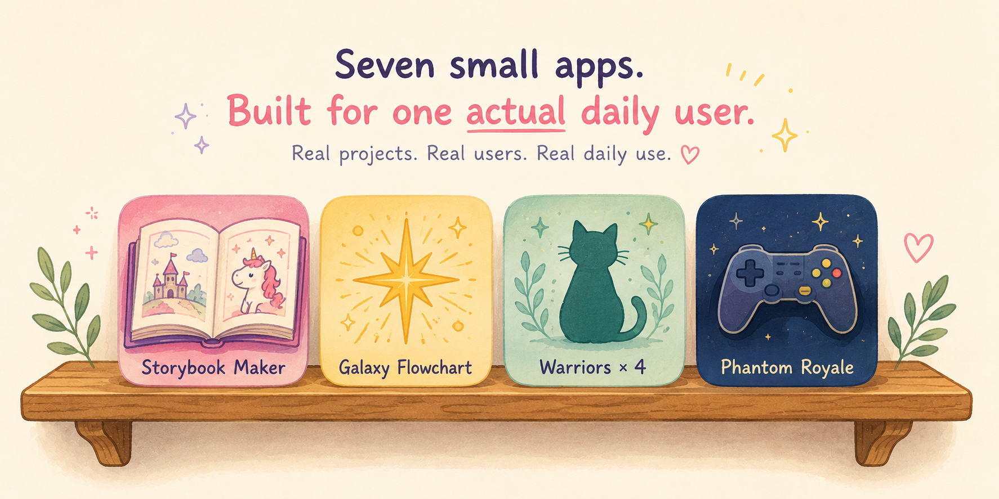

# Kid-ish

  

A landing page that links out to seven small apps built the way most portfolio projects
aren't: for one actual daily user. Nothing here was scoped, shipped, then abandoned —
each app has been in continuous use, which is a different kind of pressure than a demo
that only has to survive a screenshot.

**Live:** [kid-ish.vercel.app](https://kid-ish.vercel.app)

---

## What's inside

| App | What it does | Stack |
|---|---|---|
| Storybook Maker | An LLM writes a picture book *and* illustrates it — one hand-drawn SVG per page, from the same response, no separate image model | Vanilla JS, Cloudflare Worker |
| Galaxy Flowchart | Every Star Wars film and series, plotted across 7 color-coded eras with cross-era character threads | Vanilla JS |
| Warriors × 4 | Character charts, comics, a world guide (Clans, Warrior Code, herb glossary), and a quiz/name-generator page | Vanilla JS |
| Phantom Royale | A Fortnite companion: live cosmetics browser, locker, item shop, and a 37-entry researched lore timeline | React 19 + Vite + Tailwind |

Six of the seven are self-contained HTML files with zero build step, routed by
[`vercel.json`](./vercel.json) rewrites. Phantom Royale is the odd one out — see
[why](#one-repo-two-deploy-models) below.

---

## The interesting one: an LLM that draws its own pictures

Most "AI storybook" demos separate the writing model from the image model — two API
calls, two latencies, two failure modes. This one doesn't. A single streamed
`chat/completions` request returns the story text *and* a complete SVG illustration
per page, using a delimited output format the client parses as it streams.

That's a real security surface — the client is about to inject markup an LLM just
generated straight into the DOM — so it doesn't render the model's SVG directly.
Every illustration passes through a hand-written sanitizer before it touches the page:

- Parses the SVG with `DOMParser`, walks every node
- Removes an explicit denylist of tags (`script`, `foreignObject`, `iframe`, `object`,
  `embed`, `audio`, `video`, and the SMIL animation tags)
- Strips any `on*` event-handler attribute, anywhere in the tree
- Strips `href`/`xlink:href` unless it's an internal `#fragment` reference
- Strips inline `style="url(...)"` unless that URL is also internal
- Falls back to a static placeholder illustration if the SVG fails to parse at all

If the model forgets its closing delimiter or wraps output in a markdown fence
despite being told not to, the parser patches around it rather than dropping the
last page. Small detail, but it's the difference between "works in the demo" and
"works after 200 real generations."

**Four configurable model backends**, picked from a settings panel that sits behind
a parent gate (a randomized multiplication question, regenerated every time):

1. **Cloudflare Worker proxy** (recommended) — the Worker holds the API key as a
   server-side secret and adds the CORS header a browser needs; the key never touches
   the reader's device
2. Direct OpenAI
3. Direct Ollama Cloud
4. Any custom OpenAI-compatible endpoint (a local Ollama, LM Studio, etc.)

The Worker itself ([`worker.js`](./worker.js)) is ~80 lines: forward the request body
verbatim, inject the secret `Authorization` header, strip stale streaming-related
headers from the upstream response so a reply doesn't get truncated, and pass the
stream straight back. An optional `ALLOWED_ORIGIN` variable locks it to one origin so
a leaked Worker URL can't be used to burn someone else's API credits.

Other real touches: speech-to-text idea entry, a "Read to me" button using the
Web Speech API, and a bookshelf of finished books kept entirely in `localStorage` —
no account, no backend for this app at all beyond the model call.

### One-time setup (grown-ups) — Ollama Cloud via a free Cloudflare Worker

1. **Get a key:** sign up at [ollama.com](https://ollama.com), create one at
   **ollama.com/settings/keys**.
2. **Create the Worker** (free, ~5 min): [dash.cloudflare.com](https://dash.cloudflare.com)
   → **Workers & Pages → Create → Workers → Create Worker**. Paste in
   [`worker.js`](./worker.js), deploy.
3. **Add the secret:** Settings → Variables and Secrets → type **Secret**, name
   `OLLAMA_API_KEY`, value = your key.
4. *(Recommended)* Add a Text variable `ALLOWED_ORIGIN` set to your app's URL.
5. **Point the app at it:** open the app → gear icon (answer the math question) →
   Provider: *Ollama Cloud — via Worker proxy* → paste your Worker URL → leave the
   API key blank → Save.

---

## Two reference apps, built with the same "go deep" instinct

**Galaxy Flowchart** lays out every Star Wars film and series left-to-right across
7 named, color-coded eras — High Republic → Fall of the Republic → The Clone Wars →
Imperial Era → Galactic Civil War → New Republic → Rise of the First Order. Hover any
card for a plot summary; cross-era badges connect entries that share continuity
(Andor ↔ Rogue One, Rebels ↔ Ahsoka); a 12-character web at the bottom — each with a
small hand-built SVG portrait — traces the same faces across the whole timeline.
Pure HTML/CSS/JS, animated canvas starfield, no build step.

**Warriors** gets four pages of the same treatment: character charts filterable by
Clan (ThunderClan, ShadowClan, WindClan, RiverClan, SkyClan, StarClan, and loners),
the graphic-novel adaptations with the same filters, a world guide (the Warrior
Code, all five Clans plus StarClan, a searchable glossary, and a medicine-cat herb
guide with poison warnings), and a fun page with comprehension quizzes and a
warrior-name generator built from prefix/suffix word pools. All four are age-banded
for 6–12.

---

## Phantom Royale

A Fortnite companion app: a live cosmetics browser and search, a locker for tracking
owned *and* favorited items, today's item shop, a daily-random pick, and a storyline
mode — **37 lore entries spanning Chapters 1–7**, one per season, each with a short
narration, a map, and (where one exists) the season's launch trailer.

**Live:** [phantom-royale.vercel.app](https://phantom-royale.vercel.app) ·
**Source:** [`/phantom-royale`](./phantom-royale)

### The lore has a documented QA pipeline — and an honest gap in it

34 of those 37 entries (Chapters 1–6) went through a two-stage process that's
checked into the repo alongside the data:

- [`STORY_AGENT_REPORT.md`](./phantom-royale/src/data/STORY_AGENT_REPORT.md) — a
  research pass that cites its sources (Fandom wiki, official Epic posts, esports
  press) and explicitly flags low- and medium-confidence entries rather than
  presenting everything with false certainty
- [`OVERSEER_REPORT.md`](./phantom-royale/src/data/OVERSEER_REPORT.md) — a review
  pass that spot-checked trailer IDs live, cross-checked every map image against
  what's actually on disk, and replaced three bad/blank IDs it found

Chapter 7 (3 entries) was added to the live data after that pipeline last ran, so it
hasn't been through Story Agent/Overseer review yet — the reports currently describe
34 of the 37 entries a reader sees in the app. That gap is worth naming rather than
quietly closing in a README rewrite: it's the normal state of a real, actively-updated
project, not a demo frozen at its best moment.

### One repo, two deploy models

Every other app here is a single HTML file with no build step. Phantom Royale is a
real React 19 + Vite + Tailwind app with client-side routing and a PWA build — that
doesn't fit the "just open the file" model the rest of the repo uses. Rather than
force a framework build into the same static deploy as six no-build pages, its source
lives in this repo under `/phantom-royale` but **deploys as its own separate Vercel
project**, with its own build step and its own URL. The landing page just links out
to it.

