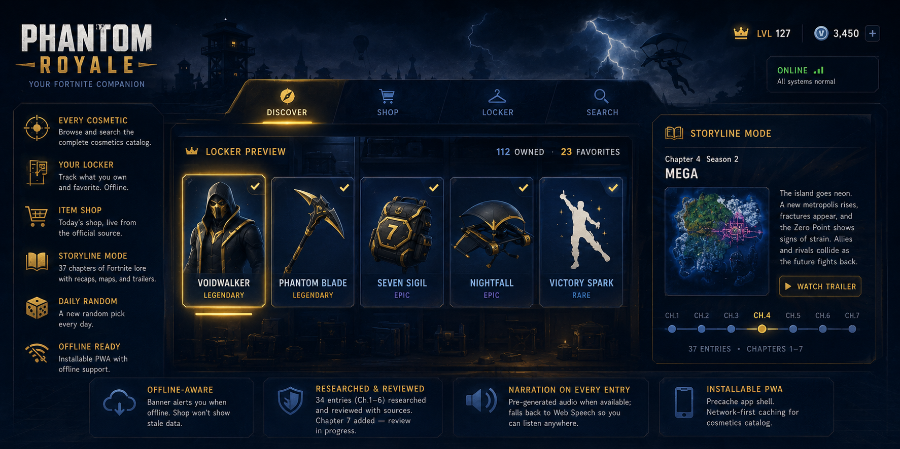

# Phantom Royale

<p align="center">
  
</p>


**Every skin, every season, every chapter of the story — in one place, offline-friendly.**

A Fortnite companion app: a live cosmetics browser and item shop, a locker for
tracking what you own and favorite, and a researched storyline mode spanning every
chapter Fortnite Battle Royale has had so far.

**Live:** [phantom-royale.vercel.app](https://phantom-royale.vercel.app)

---

## What it does

- **Discover / Search / Locker / Shop** — four tabs over one live, unauthenticated
  catalog fetch from fortnite-api.com: browse and search every cosmetic, mark items
  owned or favorited (stored locally, no account), and check today's item shop
- **Storyline mode** — a chapter-by-chapter, season-by-season lore recap: **37
  entries across Chapters 1–7**, each with a written recap, a map image, and (where
  a source trailer was confirmed) an embedded launch trailer
- **Narration on every lore entry** — tries a pre-generated audio clip per
  chapter/season first; if that file isn't ready yet, it falls back to the browser's
  Web Speech API so the feature degrades gracefully instead of breaking
- **Daily random** — a date-seeded pick from the catalog, with a "give me another"
  for a true random pull
- **Offline-aware** — a banner surfaces when the network drops, an onboarding
  overlay walks through the two things worth knowing on first launch, and the item
  shop explicitly refuses to show stale data offline rather than pretend it's current
- **Installable PWA** — precaches the app shell and network-first caches the
  cosmetics catalog for offline use; the shop is deliberately excluded from that cache

## The lore is researched and reviewed — and the README says so honestly

Of the 37 storyline entries, **34 (Chapters 1–6)** went through a two-stage pipeline
that's checked into the repo next to the data it produced:

- [`src/data/STORY_AGENT_REPORT.md`](./src/data/STORY_AGENT_REPORT.md) — a research
  pass that cites its sources (Fandom wiki, official Epic posts, esports coverage)
  and flags low- and medium-confidence entries by name rather than presenting
  everything with equal certainty
- [`src/data/OVERSEER_REPORT.md`](./src/data/OVERSEER_REPORT.md) — a review pass
  that spot-checked trailer IDs live against YouTube, cross-checked every map image
  against what's actually in `public/maps/`, and replaced three bad or missing IDs
  it caught

**Chapter 7 (3 entries)** was added after that review last ran, so those entries
haven't gone through the same process yet — `lore.json` currently has 37 entries but
the two reports describe 34 of them. That's flagged here on purpose: it's what an
actively-maintained data pipeline looks like mid-update, not a gap worth hiding.

## Stack

| Layer | Technology |
|---|---|
| Framework | React 19 + Vite 8 |
| Routing | React Router 7 |
| Styling | Tailwind CSS 4 |
| Data | fortnite-api.com (public, unauthenticated) |
| Local storage | Owned/favorited cosmetic IDs, onboarding state, last-selected mode |
| PWA | `vite-plugin-pwa`, network-first caching for the cosmetics endpoint |

## Project structure

```
phantom-royale/
├── src/
│   ├── context/AppContext.jsx     # Cosmetics fetch + owned/favorited state
│   ├── components/
│   │   ├── LobbyShell.jsx          # Tab shell: Discover / Shop / Locker / Search
│   │   ├── CosmeticCard.jsx, OfflineBanner.jsx, OnboardingOverlay.jsx
│   ├── pages/
│   │   ├── DiscoverTab.jsx, SearchTab.jsx, LockerTab.jsx, ItemShop.jsx
│   │   ├── DailyRandom.jsx, Storyline.jsx, ChapterDetail.jsx
│   │   └── ModeMapDetail.jsx      # Reload / Blitz map detail
│   ├── data/
│   │   ├── lore.json               # 37 chapter/season entries (Ch.1–7)
│   │   ├── STORY_AGENT_REPORT.md   # Research pass, sources + confidence flags
│   │   └── OVERSEER_REPORT.md      # Review pass, ID/asset spot-checks
│   └── utils/api.js, storage.js     # fortnite-api.com client, localStorage helpers
└── public/maps/                       # Chapter/season map imagery
```

## Local development

```bash
npm install
npm run dev      # http://localhost:5173
npm run build    # production build → dist/
```

## Deployment note

This app lives inside the Kid-ish hub but deploys as its **own** Vercel project (own
build step, own URL) rather than as part of Kid-ish's single static-site deploy —
see the root README for why. `vercel.json` here just adds the SPA rewrite React
Router needs so deep links and refreshes don't 404.

## Status

Live. Storyline coverage runs through Chapter 7 (Chapter 7 not yet through the
documented review pipeline — see above); the map-detail pages (Reload/Blitz) and
daily-random pull from separate map-data files.
